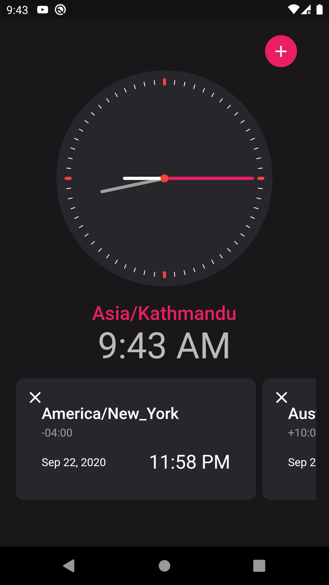
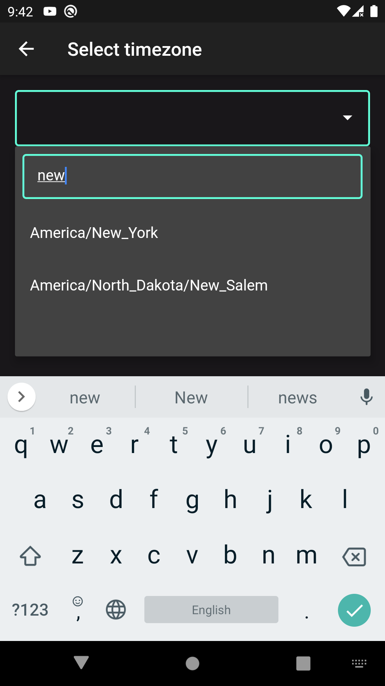
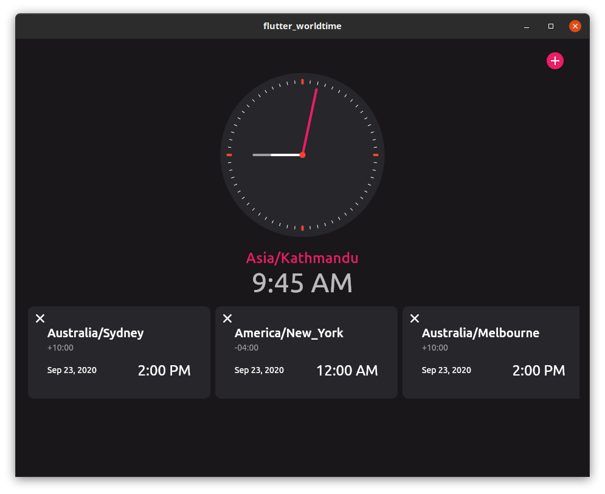

# Worldtime Clock

A world time clock using [worldtime.org](http://worldtimeapi.org/) API and [Flutter](https://flutter.dev). Runs on Mobile, Web and Desktop.

For a version that works with Flutter 3.x (also uses hooks) check [for-flutter-3.x](https://github.com/lohanidamodar/flutter_worldtime/tree/for-flutter-3.x) branch. Thanks to [ValeriusGC](https://github.com/ValeriusGC) for the updates.

**Note:** Using riverpod as state management solutions

## Previews
   
 
